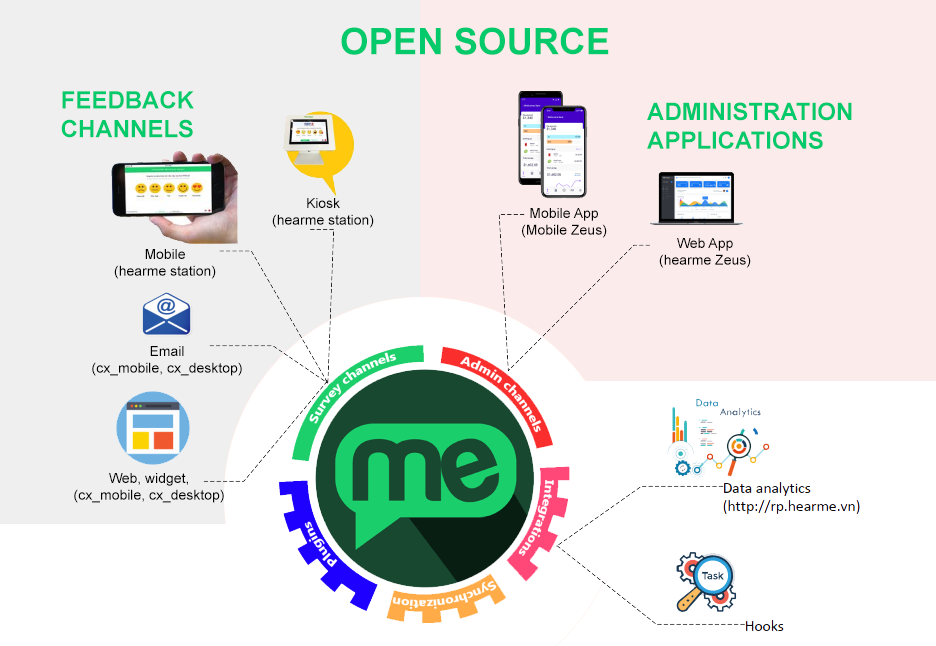

# hearme cx_mobile


## Description

The **hearme cx_mobile** module is an open-source repository that empowers clients to customize the UI and application logic according to their needs. This module allows users to create a web app for collecting feedback in the **online channel, running in Mobile browser**. It is an integral part of the **hearme** CXM platform, providing a comprehensive suite of tools for collecting and analyzing customer feedback.

- **hearme cx_mobile** utilizes services from the **hearme** platform, offering a complete set of tools for collecting and analyzing customer feedback.

- With **hearme cx_mobile**, you can tailor the feedback screen to align with your brand or intercept feedback events before and after sending feedback. Every feedback logic is processed, and you can configure questionnaires in the administration application.

- You can include customer and additional information in the feedback by transferring parameters into the link of this module. This allows the CX manager to track customer information for each feedback, supporting the Close the Loop activity.

- After collecting feedback with this online channel, you can manage your feedback through the **hearme** web application at [hearme.vn/zeus](hearme.vn/zeus) or by installing the **hearme CXM** mobile app on your iOS or Android device.

- This project uses the Ionic 2 framework.

## hearme architechture



## Demonstration:
- Kiosk feedback channel: https://www.youtube.com/watch?v=ThOjFk_Ztv8&list=PLFoi8tG0KXO-mViolS5_1orwIA4GZwYid 
- You can configure questions, image, and trademark as you want: https://www.youtube.com/watch?v=uzsVHHXlpNY

## Help for developing application:

1. **Full Programming APIs:** [Hearme for Developers APIs version 2.0.1](https://hearme.vn/help/statics/hearme_dev_APIs_v2.0.1.pdf)
2. **Integration for Online feedback Channel:** [Hearme for Online Channel 2.0.1](https://hearme.vn/help/statics/hearme_dev_APIs_ONLINE_v2.0.1.pdf)
3. **Integration for feedback Kiosk:** [Hearme for Kiosk Channel 2.0.1](https://hearme.vn/help/statics/hearme_dev_APIs_SYN_v2.0.1.pdf)
4. **Integration with Zapier:** [Hearme - Zapier Integration](https://hearme.vn/help/statics/hearme-zapier-documentation_202208.pdf)
5. **Help:** [Other integration](https://hearme.vn/help/en/integration/)


# Steps to collect feedback through online channel


## Enviroment requirements for this project
- Nodejs >= 8.17
- Ionic >= 2


## Run poroject

Install and start web platform

```bash
$ sudo npm install -g ionic
$ ionic serve
```

Build to release for web:

```
$ionic build –-prod
```

## Getting started to collect feedbacks with hearme platform

1. Register a **hearme** account at website [hearme.vn](https://hearme.vn/) 
2. Once you have registered, you can configure your account as steps guided in the onboarding page. Please look for detail information in [help page](https://hearme.vn/help/en/implementation/)

3. Create and get survey link for [web channel device](https://hearme.vn/help/en/admin/#web-survey-channel)
4. Change root domain: https://cx.hearme.vn/ with your domain hosting this project
5. You can add parameters, attach extra information to feedback link. Refer information at: [Hearme for Online Channel 2.0.1](https://hearme.vn/help/statics/hearme_dev_APIs_ONLINE_v2.0.1.pdf)


# hearme versions and roadmap

## Version 4.x - Upcoming with AI
- CX Expert Assistant powered by AI for CX practitioners
- Employee Assistant
- Customer Assistant integrated into feedback channels

## Version 3.x
This software version brings significant improvements in user experience and introduces many important features:

- On-boarding page: helps new users easily understand and configure the system step by step.
- Dashboard system: helps administrators quickly grasp system performance and important information up to the current moment.
- Correlation data analysis: helps business leaders identify important factors and positive factors affecting customer satisfaction, thereby helping businesses come up with plans to improve customer satisfaction scores.
- System to support survey question setup: allows the creation of survey sets from sample surveys for each field, export/import survey configuration data, and preview survey screens directly on the management system. Configuring survey questions is also easier and more straightforward.
- Survey analysis features are also upgraded for a better user experience.
- System for managing alert messages and system notification messages.

## Version 2.6.0
- Integration with multi-channel sales system: nhanh.vn
- Providing an interface for system integration via Zapier
- Improved security for the hook registration function in the hearme system
- Optimized the submission of evaluation data when the device has an unstable connection

# Support information

Whenever you have a support request, you can reach out to Hearme using the following methods:

1. **Help document:** [https://hearme.vn/help/en/](https://hearme.vn/help/en/)
2. **Facebook:** [https://fb.com/hearme.vn](https://fb.com/hearme.vn)
3. **FAQs:** [http://Support.hearme.vn](http://support.hearme.vn)
4. **Email for assistance:** [contact@hearme.vn](mailto:contact@hearme.vn)
